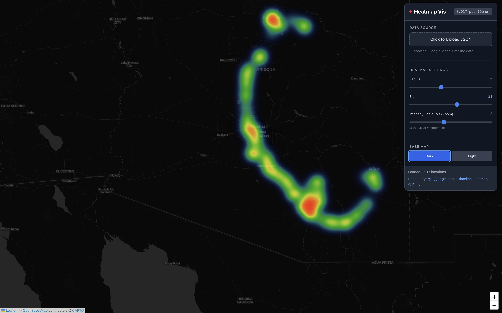
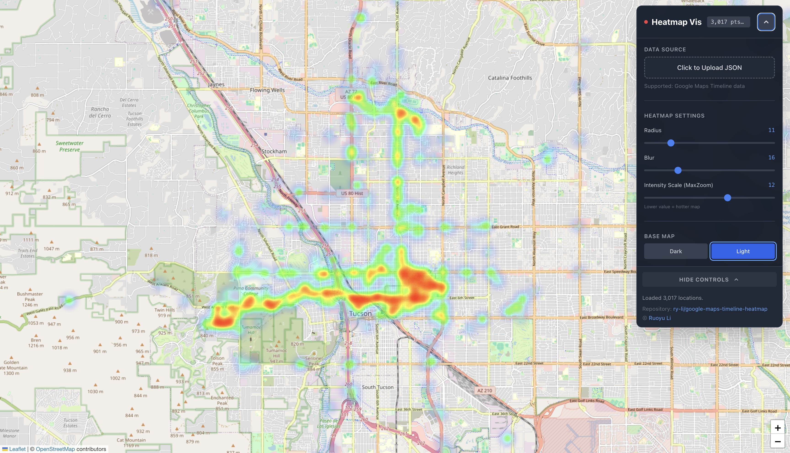

# google-maps-timeline-heatmap

Open-Source Google Maps Timeline Heatmap Visualization

| File | About |
| --- | --- |
| ***index.html*** | interactive map for heatmap visualization
| ***location-history.json*** | sample data as the demo - you can upload your own
## Preview

## How to export Google Maps Timeline data:

**Official Doc:** https://support.google.com/maps/answer/6258979

**Note:** Timeline is no longer available on computers

**For iPhone & iPad:**
* Open the *Google Maps* app
* Tap profile picture or initial (top right) → *Settings* → *Location & privacy* → *Export Timeline data* (under *Timeline*) → *Save to Files*
* Select your preferred storage location → *Save*

**For Android:**
* Open the device's *Settings* app
* Tap *Location* → *Location services* → *Timeline* → *Export Timeline data* (under *Timeline*) → *Continue*
* Select your preferred storage location → *Save*

## Acknowledgement:

Coded with assistance from *Google Gemini 3 Pro*
